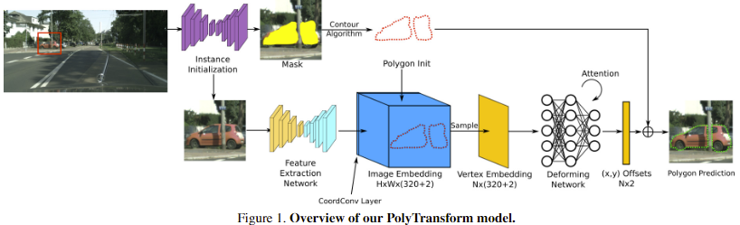

# Polygon Instance Segmentation

Experimenting with instance segmentation models with polygon prediction heads.

## PolyTransform

Attempting to implement the PolyTransform paper that achieves [highest AP on CityScapes](https://paperswithcode.com/sota/instance-segmentation-on-cityscapes).

Unfortunately the accompanying code for the paper has been taken down. The paper is worthy of being reimplemented as it predicts polygon vertex offsets rather than a dense pixel mask.

Currently attempting a simpler task of predicting vertices given an objects mask.

### Progress

- [x] ResNet FPN
- [x] Image Embedding
  - [x] CoordConv
  - [ ] Downsampling channels 256 -> 64
    - Kernel shape? 
- [x] Sampling with grid_sample
- [x] Transformer?
  - Influenced by ViT, without positional encoding (as added by CoordConv)
- [ ] Contour Algorithm
  - Paper references *Topological structural analysis of digitized binary images by border following* found it is implemented in OpenCV as FindContours
  - Would it be possible to use a CNN?
    - benefit of being differentiable, probably faster
  - or, predict circle center and radius for initialization 
- [ ] Train to predict mask vertices 

## Instance Segmentation Transformer

In future, want to adapt ISTR or similar transformer model with PolyTransform polygon head.

## References

Hu, J., Cao, L., Lu, Y., Zhang, S., Wang, Y., Li, K., Huang, F., Shao, L., & Ji, R. (2021). ISTR: End-to-End Instance Segmentation with Transformers. ArXiv:2105.00637 [Cs]. https://arxiv.org/abs/2105.00637

Liang, J., Homayounfar, N., Ma, W.-C., Xiong, Y., Hu, R., & Urtasun, R. (2021). PolyTransform: Deep Polygon Transformer for Instance Segmentation. ArXiv:1912.02801 [Cs]. https://arxiv.org/abs/1912.02801

‌
‌